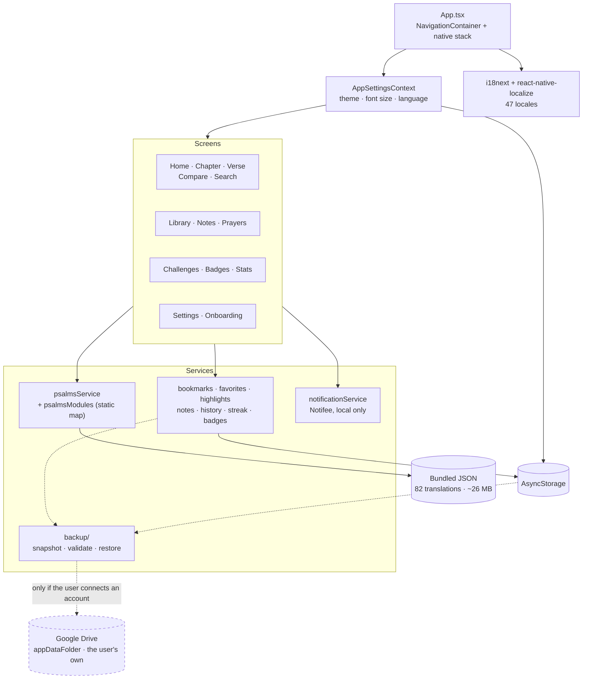

<div align="center">

# Psalms Way

**All 150 Psalms, in 82 translations and 47 interface languages, read completely offline.**

[](https://github.com/atj393/psalms-way-app/actions/workflows/ci.yml)
[](https://play.google.com/store/apps/details?id=com.psalmswayapp)
[](#requirements)
[](https://reactnative.dev)
[](tsconfig.json)
[](LICENSE)

https://github.com/user-attachments/assets/c70a88ca-aee1-4f6e-a6d4-47c84088a158

</div>

---

## Status

- **Google Play:** [live](https://play.google.com/store/apps/details?id=com.psalmswayapp), `com.psalmswayapp`, 500+ downloads.
- **Current release:** `2.0.0` (versionCode 9)
- **Platform:** Android. An `ios/` project exists but is not built or shipped.
- **Network:** reading is entirely offline. The app makes network requests only
  when the user explicitly opts into Google Drive backup — a feature that is off
  by default and requires connecting an account.

There is also a companion [Chrome extension](https://github.com/atj393/psalms-way-browser-extension)
for reading Psalms in the browser.

## Why this exists

Most scripture apps assume a connection, an account, and a single translation.
This one assumes none of those. It was built for reading in places where there
is no signal and no interest in signing in to anything, and for people who read
in a language that scripture apps usually treat as an afterthought.

That shaped every technical decision below: everything is bundled, nothing is
fetched, and the translation list is long rather than convenient.

## What it does

**Reading**
- All 150 Psalms in **82 translations**, selectable at any time.
- **Compare** two translations of the same Psalm side by side.
- **Search** across the text.
- Random verse, full chapter, and direct chapter navigation.
- **Prayers** collection alongside the Psalms.

**Making it yours**
- Bookmarks, favourites, highlights, and free-form notes per verse.
- Reading history.
- Font size and light/dark/auto theme, persisted.
- **47 interface languages**, auto-detected from the device locale.

**Staying with it**
- Daily reading reminders (local notifications only).
- Reading streaks, challenges, badges, and stats.

## Engineering notes

The interesting constraints here came from "offline" and "81 translations"
colliding.

**Metro cannot resolve a dynamic `require`.** React Native's bundler needs every
`require()` path to be statically analysable at build time, so the obvious
implementation, building a path from the selected translation's id, silently
fails to bundle anything. `services/psalmsModules.ts` is therefore an explicit
static map of all 81 translations. It looks repetitive on purpose: it is the
only shape Metro can actually see, and generating it is a build step, not a
runtime one.

**~26 MB of scripture ships inside the APK.** That is the price of working with
no connection, and it is a deliberate trade: a smaller download that needs the
network would defeat the point. Translation data is kept out of the JS-heavy
path and behind the module map so only what is opened is resolved.

**Locale detection has to degrade gracefully.** `react-native-localize` reports
the device's preferred tags, and `findBestLanguageTag` picks the closest of the
47 shipped locales. Anything unmatched falls back to English rather than
rendering raw i18n keys.

**All persistence is local and schema-free.** Bookmarks, notes, highlights,
streaks, and settings live in AsyncStorage behind small single-purpose services
(`bookmarksService`, `notesService`, `streakService`, …) rather than one store.
There is no migration system, so each service tolerates missing or partial data
instead of assuming its own shape.

**Notifications are local-only.** Reminders are scheduled with Notifee on the
device. There is no push infrastructure, no token, and no server.

Reminders are a rolling window of one-shot triggers rather than one repeating
trigger. Android replays a repeating notification with its original payload, so
a single repeating trigger can only ever deliver the same verse — the app queues
14 days ahead instead, each day with its own verse, and tops the window up
whenever the app is opened. Which verse a given day gets is a pure function of
(date, translation), so re-running the scheduler recomputes identical content
for days already queued and cannot double-book a day.

**Backup is optional and offline-first.** The app is fully functional with no
account, forever. If the user connects Google Drive, only their own data —
bookmarks, notes, highlights, history, progress and preferences — is written to
their private `appDataFolder`, using the narrow `drive.appdata` scope. The
bundled psalms are never uploaded, and this project operates no server: the data
goes from the device to the user's own Drive. See
[docs/GOOGLE_DRIVE_SETUP.md](docs/GOOGLE_DRIVE_SETUP.md).

## Architecture



The only path off the device is the dashed one, and it exists solely when the
user has explicitly connected a Google account. Reading, search, comparison and
reminders never leave the device.

```text
Bundled Psalms --> local reading
                       |
AsyncStorage <-- user data --> Backup Snapshot Layer
                                   |
                                   +-- optional: Google Drive appDataFolder
```

```
App.tsx              NavigationContainer + native stack
context/             global settings (theme, font size, language)
screens/             16 screens
components/          Header, Navigation, Icons, M3 primitives, sheets
services/            psalms data access + per-feature persistence
i18n/locales/        47 UI translations
psalms_extracted/    81 bundled Psalm translation files (82 with modern English)
android/             Gradle project, applicationId com.psalmswayapp
```

## Requirements

- Android 7.0+ (`minSdkVersion 24`, set in `android/build.gradle`)
- Node 22.11+ (`package.json` engines) and a configured Android SDK for development

## Local development

```bash
npm install
npm start              # Metro bundler
npm run android        # build and install on a connected device/emulator
npm run android:pick   # choose a device interactively
npm test               # jest
npm run lint           # eslint
```

On a physical device, forward the Metro port first:

```bash
adb reverse tcp:8081 tcp:8081
```

## Testing

`npm test` runs a smoke test that renders the full application: navigation,
i18n initialisation, the settings context, and the translation module map.

That is a deliberately small suite, but it is not a trivial one: because every
translation is wired through a static `require` map and i18n initialises at
import time, this test fails loudly on the failure mode this app is most prone
to, a bundling or import-time error that would crash on launch rather than
show up as a wrong value.

Not covered: per-screen interaction, persistence round-trips, and notification
scheduling. Those are checked by hand on a device.

CI runs the test suite on every push. `npm run lint` runs alongside it but does
not gate the build yet: the workflow sets `continue-on-error` because of
pre-existing eslint errors (unused variables and one `exhaustive-deps`) that
need clearing first.

## Known limitations

- Android only in practice. The `ios/` project is unbuilt and untested.
- The APK is large by design (~26 MB of bundled scripture).
- No AsyncStorage migration system, so services tolerate partial data instead.
- Reading data lives only on the device, with no sync or backup.
- Notification delivery is subject to Android Doze and OEM battery management.

## Privacy

No analytics, no telemetry, no advertising, and no account requirement. Psalm
text is bundled in the APK and read offline.

**Optional Google Drive backup** is the single exception to "no network", and it
is off unless the user turns it on:

- Reading Psalms never requires an account and never makes a network request.
- Connecting Google is entirely optional; the app is fully functional without it.
- Only user-created data is uploaded: bookmarks, favourites, highlights, notes,
  reading history, streak, badges, challenge progress and preferences.
- The bundled psalm translations, caches and OAuth tokens are never uploaded.
- Data goes to the user's own private Drive `appDataFolder` under the narrow
  `drive.appdata` scope, which cannot read anything else in their Drive.
- **This project operates no server. The developer never receives this data.**
  It travels from the device to the user's own Google account.
- The user can delete it at any time from Google Drive settings, without the app.
- Disconnecting does not affect offline reading, and does not delete the backup.

Restoring replaces local data rather than merging it, and always shows what the
backup contains and when it was made before doing so. If a restore fails part
way, the previous local data is put back.

## License

Application source code is released under the [MIT License](LICENSE), which permits
personal and commercial use, modification, and redistribution, provided the copyright
and licence notice are kept.

Psalm translations bundled under `psalms_extracted/` are **not** covered by that
licence. They come from public-domain and third-party sources and remain under their
own respective terms.
